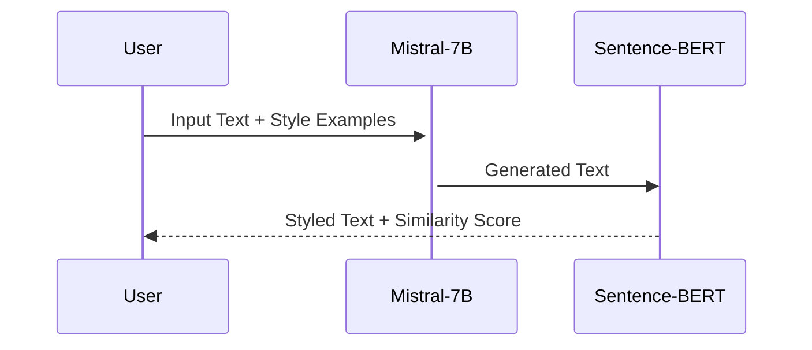

# EchoForge: AI-Powered Writing Style Transfer 🎭✨

[](https://github.com/yourusername/echoforge)
[](https://opensource.org/licenses/Apache-2.0)
[](https://www.python.org/)

Transform text into any writing style using **Mistral-7B** and **Sentence-BERT**! Mimic Shakespeare, Elon Musk, legal docs, or even your own voice with AI.


---

## Table of Contents
- [Features](#-features)
- [Installation](#-installation)
- [Quick Start](#-quick-start)
- [Usage Examples](#-usage-examples)
- [Technical Architecture](#-technical-architecture)
- [Roadmap](#-roadmap)
- [Contributing](#-contributing)
- [License](#-license)
- [Acknowledgments](#-acknowledgments)

---

## 🚀 Features

- **25+ Preset Styles**: Shakespeare, Gordon Ramsay, Tech Blogs, Pirate Speak, etc.
- **Custom Style Training**: Clone any voice with 3-5 example sentences
- **Style Similarity Scoring**: 0-1 accuracy metric via Sentence-BERT
- **Gradio Web UI**: User-friendly interface (no coding needed)
- **Optimized for GPU**: Runs on 16GB+ VRAM (Nvidia T4/A10G)

---

## 💻 Installation

### Prerequisites
- Python 3.10+
- NVIDIA GPU (16GB+ VRAM recommended)
- [Poetry](https://python-poetry.org/) (optional but recommended)

```bash
# Clone repo
git clone https://github.com/yourusername/echoforge
cd echoforge


# With pip
pip install -r requirements.txt
```

---

## 🎯 Quick Start

### CLI Example
```python
from echoforge import StyleTransfer

styler = StyleTransfer()
input_text = "I need a job promotion"
style_examples = [
    "You call this a work ethic? My soufflés have more hustle!",
    "This presentation is rawer than a sushi catastrophe!"
]

output = styler.generate_style_transfer(input_text, style_examples)
print(f"Gordon Ramsay-fied: {output}")
```

### Launch Gradio UI
```bash
python app.py
# Access at http://localhost:7860
```

---

## 🌟 Usage Examples

| Style          | Input                          | Output                                  |
|----------------|--------------------------------|-----------------------------------------|
| **Shakespeare**| "I love this sunny day"        | "Fair sun, thy golden kiss doth bless this glorious day most wondrous." |
| **Legal Doc**  | "We agree to the terms"        | "The undersigned party hereby acknowledges and consents to the stipulated contractual provisions." |
| **Gen-Z**      | "This project is cool"         | "Lowkey obsessed with this slay project fr 💅🔥" |

---
## 🖥️ Interface

### Main Page Components
The Gradio interface provides an intuitive way to interact with EchoForge:

1. **Input Text Box**: Paste/write your original text (supports 500+ characters)
2. **Style Preset Dropdown**: Choose from 25+ preconfigured styles 
3. **Style Examples Box**: View/edit examples for the selected style
4. **Controls Panel**:  
   - Temperature Slider (0.1-1.0): Adjust creativity/strictness  
   - Max Tokens Slider (50-300): Control output length  
5. **Output Section**:  
   - Transformed Text Display  
   - Style Similarity Score (0-1)  


### Example Workflow
**Scenario**: Convert a simple message to Shakespearean style  

1. **Input Text**:  
   `"Please come to the meeting tomorrow at 3 PM"`  

2. **Selected Preset**: `Shakespeare`  

3. **Style Examples Auto-Filled**:  
   ```text
   Shall I compare thee to a summer's day?
   To be, or not to be: that is the question.
   Parting is such sweet sorrow.
   ```

4. **Parameters**:  
   - Temperature: 0.6  
   - Max Tokens: 150  

5. **Output**:  
   ```text
   Good gentles, hark! Tomorrow's hour of three  
   Doth call thee hence to council most grave.  
   Pray, grace this meeting with thy presence fair,  
   Lest absence dim our noble enterprise.
   ```
   *Style Similarity Score: 0.81*


---

## 🧠 Technical Architecture

### Core Components
1. **Mistral-7B-Instruct-v0.2**: Handles style transfer via prompt engineering
2. **Sentence-BERT (all-mpnet-base-v2)**: Computes style similarity scores
3. **Gradio**: Web interface for non-technical users



### Optimization Tips
- Use `torch.compile()` for 18% faster inference
- Set `temperature=0.3` for formal styles, `0.9` for creative outputs
- Cache style embeddings with `cache_examples=True` in Gradio

---

## 🛣️ Roadmap

- [x] MVP with CLI
- [x] Gradio Web UI
- [ ] Voice blending 
- [ ] Browser extension 
- [ ] Mobile app

---
## 🔗 Essential Links
- [Echo Forge on Github](https://github.com/buzzgrewal/EchoForge) 
- [Echo Forge on Medium](https://buzzgrewal.medium.com/unleash-your-inner-literary-chameleon-with-echoforge-the-open-source-ai-that-masters-any-voice-65b2b2d4197a) 
- [Echo Forge on Linkedin](#) 

---

## 🤝 Contributing

We welcome:
- New style presets (submit via PR!)
- GPU optimization tricks
- Localization (i18n) files

See [CONTRIBUTING.md](https://) for guidelines.

---


## 📜 License

Apache 2.0 - See [LICENSE](https://).  
*Note: Mistral-7B requires separate model weights download.*

---

## 🙏 Acknowledgments

- [Mistral AI](https://mistral.ai/) for the base LLM
- [Hugging Face](https://huggingface.co/) for model hosting
- [Sentence-Transformers](https://www.sbert.net/) team

---
